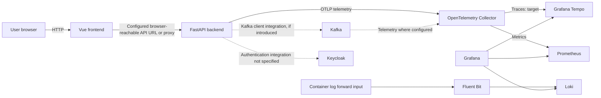

# Context and Scope

## Business Context

The system is a starter framework for developers building a web application. A user accesses the Vue frontend; the frontend can call the FastAPI API. Developers operate the application and its supporting infrastructure through Docker Compose.

No business-domain services or data workflows beyond the initial health endpoint are specified.

## Technical Context

The following is the intended repository-level boundary. Kafka application traffic is conditional: the repository currently defines no producer/consumer workflow.

The repository also defines Keycloak as an identity service. The current compose file starts it, but no application authentication flow is specified in the backend or frontend requirements. Optional external model service Ollama is mentioned in the main Compose comments but is not defined as a service in that file and is outside this system boundary.

**Technical interfaces:** HTTP from browser to frontend and API; OTLP over gRPC/HTTP into the Collector; Prometheus scrape from the Collector; Fluent Forward input and Loki output for logs; Compose-network endpoints for supporting services. Exact Kafka listener and Tempo storage settings remain implementation decisions.

| Information | Producer | Consumer | Channel |
|---|---|---|---|
| Web requests | Browser / Vue | Vue / FastAPI | HTTP; browser-visible host or proxy URL |
| Traces and metrics | Instrumented application or configured services | OpenTelemetry Collector | OTLP gRPC/HTTP |
| Traces (target) | OpenTelemetry Collector | Tempo | OTLP over Compose network |
| Metrics | OpenTelemetry Collector | Prometheus | Prometheus scrape endpoint |
| Container logs | Docker logging driver | Fluent Bit, then Loki | Fluent Forward, then Loki API |
| Messages (conditional) | Application producer | Application consumer | Kafka protocol; contract not defined |
