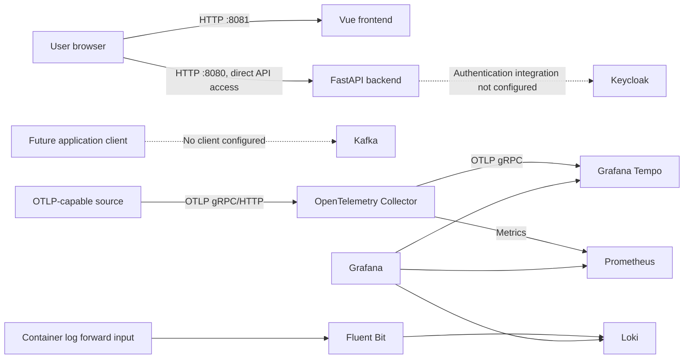

# Context and Scope

## Business Context

The system is a starter framework for developers building a web application. A user accesses the Vue frontend; the frontend can call the FastAPI API. Developers operate the application and its supporting infrastructure through Docker Compose.

No business-domain services or data workflows beyond the initial health endpoint are specified.

## Technical Context

The following is the configured repository-level boundary. Kafka application traffic is conditional: the repository defines no producer/consumer workflow, and the Vue frontend currently makes no API calls.

The Compose project also starts Keycloak as an identity service, but no application authentication flow is configured. Optional external model service Ollama is mentioned in the main Compose comments but is not defined as a service and is outside this system boundary.

**Technical interfaces:** HTTP from browser to Vue at `127.0.0.1:8081` and directly to FastAPI at `127.0.0.1:8080`; OTLP over gRPC/HTTP into the Collector; Prometheus scrape from the Collector; Fluent Forward input and Loki output for logs; Kafka bootstrap endpoints `kafka:9092` (Compose) and `localhost:29092` (host). Tempo uses local storage with 24-hour block retention.

| Information | Producer | Consumer | Channel |
|---|---|---|---|
| Web requests | Browser | Vue frontend or FastAPI directly | HTTP; host-published ports 8081 and 8080 |
| Traces | OTLP-capable source, if configured | OpenTelemetry Collector, then Tempo | OTLP gRPC/HTTP ingress; Collector to Tempo over OTLP gRPC |
| Metrics | OpenTelemetry Collector | Prometheus | Prometheus scrape endpoint |
| Container logs | Docker logging driver | Fluent Bit, then Loki | Fluent Forward, then Loki API |
| Messages (not currently configured) | No producer defined | No consumer defined | Kafka protocol; broker available at `kafka:9092` in Compose |
