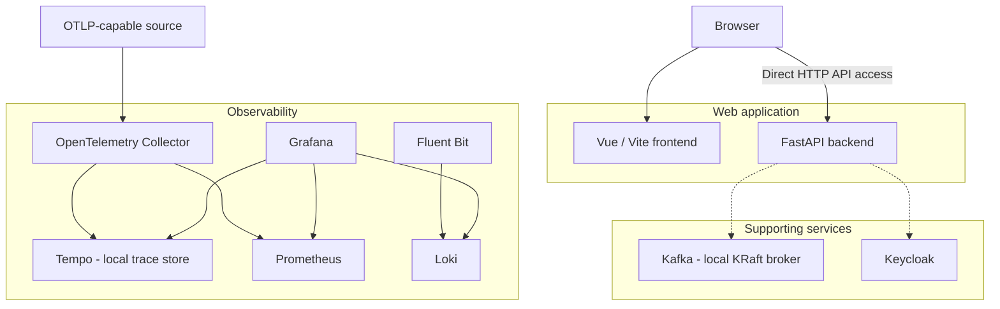

# Building Block View

## Whitebox Overall System

The system is a repository of cooperating web applications and local infrastructure. The Compose and configuration files are the deployment composition boundary.

Dashed relationships are conditional or not configured as application integrations. The current Compose definition configures Tempo and Kafka, but the backend has no telemetry instrumentation or broker client and the frontend makes no API request. The Compose configuration and image builds have not been exercised against a running Docker Engine.

| Building block | Responsibility | Interfaces / location | State |
|---|---|---|---|
| Vue frontend | Render the browser-facing static application. | HTTP `127.0.0.1:8081`; `frontend/`, served by Nginx. | Existing app; container build configured. No API calls. |
| FastAPI backend | Serve the versioned HTTP API, initially including health. | HTTP `127.0.0.1:8080`, `/api/v1`; `backend/`. | Existing app; container build and health check configured. |
| Kafka | Provide a local single-node KRaft broker. | `kafka:9092` in Compose; `localhost:29092` on host. | Apache Kafka 3.9.1 configured with a named data volume, plaintext and no client authentication; no application client. |
| Keycloak | Provide identity-service infrastructure. | HTTP host port 18080. | Existing Compose service; application integration unspecified. |
| OpenTelemetry Collector | Receive OTLP telemetry, export traces to Tempo, and expose metrics for scraping. | OTLP gRPC/HTTP; metrics endpoint; `deploy/configs/otel-collector/`. | Exporter configured for `tempo:4317`; app instrumentation is not configured. |
| Tempo | Store and serve distributed traces for Grafana. | OTLP ports 4317/4318 on Compose network; query/readiness port 3200. | Grafana Tempo 2.7.2 configured with local WAL/blocks and 24-hour retention. |
| Prometheus | Scrape and retain metrics. | HTTP query API; `deploy/configs/prometheus/`. | Existing service; mounted config path is aligned. |
| Loki | Store/query logs. | HTTP API; `deploy/configs/loki/`. | Existing service. |
| Fluent Bit | Receive forwarded container logs and send them to Loki. | Fluent Forward input; Loki output; `deploy/configs/fluent-bit/`. | Existing service. |
| Grafana | Present dashboards and query data sources. | HTTP UI; datasource provisioning under `deploy/configs/grafana/`. | Existing service; Prometheus, Loki, and Tempo are provisioned. |

### Application Interface

The browser loads Vue at `127.0.0.1:8081`; FastAPI is separately reachable at `127.0.0.1:8080`. The current Vue page does not call the API. If that changes, the configured endpoint must be browser-resolvable or served through an appropriate proxy; container-only service DNS is not a browser URL.

### Telemetry Interfaces

OTLP-capable components can send traces and metrics to the Collector. The configured trace exporter sends to Tempo and its Prometheus exporter remains available for scraping. Docker-forwarded logs are received by Fluent Bit and sent to Loki. The current application source has no telemetry instrumentation.

### Messaging Interface

Kafka exposes `kafka:9092` on the Compose network and `localhost:29092` on the host. Topic names, message formats, delivery guarantees, and application clients are not defined by current application requirements and must not be inferred from the broker replacement alone. Broker availability is a deployment capability, not a defined application message contract.
