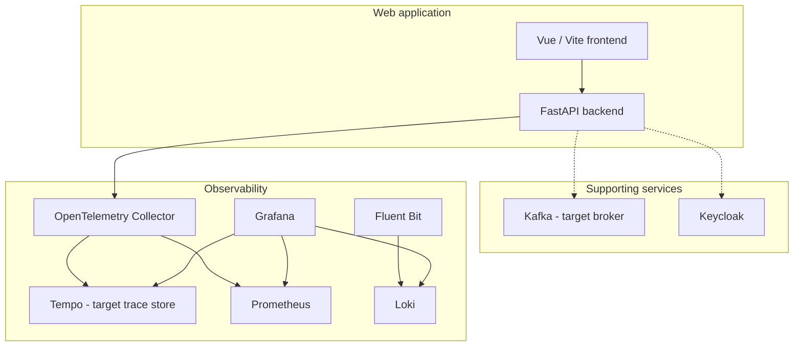

# Building Block View

## Whitebox Overall System

The system is a repository of cooperating web applications and local infrastructure. The Compose and configuration files are the deployment composition boundary.

Dashed relationships are conditional or not yet specified as application integrations. In the current deployment baseline, Jaeger and RabbitMQ occupy the requested future Tempo and Kafka roles.

| Building block | Responsibility | Interfaces / location | State |
|---|---|---|---|
| Vue frontend | Render the browser-facing application. | HTTP; `frontend/`, Vite project. | Existing application; container orchestration requested. |
| FastAPI backend | Serve the versioned HTTP API, initially including health. | HTTP `/api/v1`; `backend/`. | Existing application; container orchestration requested. |
| Kafka | Provide the replacement message-broker service. | Kafka bootstrap/listener endpoint on the Compose network. | Target; client workflow unspecified. |
| Keycloak | Provide identity-service infrastructure. | HTTP service endpoint on the Compose network. | Existing Compose service; application integration unspecified. |
| OpenTelemetry Collector | Receive OTLP telemetry, export traces and expose metrics for scraping. | OTLP gRPC/HTTP; metrics endpoint; `deploy/configs/otel-collector/`. | Existing service; trace exporter currently targets Jaeger. |
| Tempo | Store and serve distributed traces for Grafana. | OTLP ingestion and query API on Compose network. | Target replacement for Jaeger. |
| Prometheus | Scrape and retain metrics. | HTTP query API; `deploy/configs/prometheus/`. | Existing service. |
| Loki | Store/query logs. | HTTP API; `deploy/configs/loki/`. | Existing service. |
| Fluent Bit | Receive forwarded container logs and send them to Loki. | Fluent Forward input; Loki output; `deploy/configs/fluent-bit/`. | Existing service. |
| Grafana | Present dashboards and query data sources. | HTTP UI; datasource provisioning under `deploy/configs/grafana/`. | Existing service; datasource currently includes Jaeger. |

### Application Interface

The browser uses HTTP to load the Vue frontend. If browser code calls the API, the configured endpoint must be resolvable from the browser or served through an appropriate proxy. Container-only service DNS is not a browser URL.

### Telemetry Interfaces

Instrumented components send OTLP to the Collector. The Collector routes traces to Tempo in the target design and exposes metrics for Prometheus scraping. Docker-forwarded logs are received by Fluent Bit and sent to Loki.

### Messaging Interface

Kafka will expose a Compose-network bootstrap endpoint. Topic names, message formats, delivery guarantees, and application clients are not defined by current application requirements and must not be inferred from the broker replacement alone. Broker availability is a deployment capability, not a defined application message contract.
