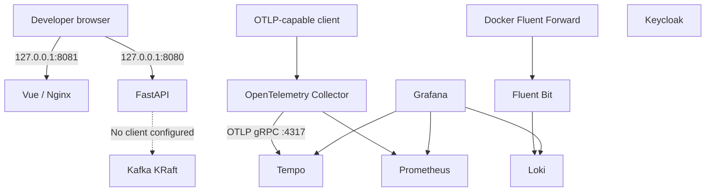

# Deployment View

## Infrastructure Level 1

The local development system is defined by `docker-compose.yml` plus the `docker-compose.web.yml` overlay, run from `deploy/`. Services share the observer network; app ports, Tempo query, and the Kafka host listener bind to loopback. Existing Loki, Prometheus, Collector, Grafana, Fluent Bit, and Keycloak ports retain Compose's default host binding, so keep this stack on a trusted development machine. Docker image builds and live deployment have not been verified because the Docker Engine is unavailable.

The diagram shows the configured development deployment. Dashed edges are conditional application integrations, not current source-code behavior.

**Motivation:** Compose provides a repeatable local environment with explicit service names, networks, configuration mounts, and persistent data volumes.

**Quality and performance features:** Local readiness checks exist for some infrastructure services. The system has no declared production SLA, scale target, or resource profile. Local Compose configuration must not be treated as a highly available production deployment.

| Compose/configuration area | Building blocks | Notable mapping |
|---|---|---|
| `deploy/docker-compose.yml` | Loki, Prometheus, Tempo, Collector, Grafana, Fluent Bit, Kafka, Keycloak | Infrastructure services; observer network; named volumes include Tempo and Kafka state. |
| `deploy/docker-compose.web.yml` | FastAPI and Vue | Builds from `../backend` and `../frontend`; publishes `127.0.0.1:8080` and `127.0.0.1:8081`; health checks are defined. |
| `deploy/configs/otel-collector/` | Collector | OTLP receivers; traces export to Tempo; metrics endpoint remains available to Prometheus. |
| `deploy/configs/grafana/provisioning/` | Grafana | Prometheus, Loki, and Tempo datasources. |
| `deploy/configs/fluent-bit/` | Fluent Bit | Forward input on 24224 and Loki output to `skb-loki:3100`. |

## Infrastructure Level 2

### Web Application Services

The overlay defines buildable FastAPI and Vue services with host access at `127.0.0.1:8080` and `127.0.0.1:8081`. The Vue page is static and does not need an API proxy. Both services join the observer network; neither depends on a service it does not consume.

### Observability Services

The configured trace path is Collector to Tempo to Grafana. Tempo accepts internal OTLP on 4317/4318, exposes query/readiness on 3200, and stores WAL/blocks in `tempo_data` with 24-hour retention. Prometheus continues to scrape Collector metrics; Fluent Bit continues to send forwarded logs to Loki.

### Messaging and Identity Services

Kafka is configured as a persistent, single-node KRaft broker with `kafka:9092` for Compose clients and loopback `localhost:29092` for host clients. It uses plaintext without authentication and is not a production/shared-network configuration. Keycloak is deployed independently; no application identity integration is configured.

### Deployment Entry Points

All lifecycle helpers resolve their own directory and use the same two Compose files. `deploy/0_create_env.sh` creates the required Grafana and Keycloak passwords; optional GitHub package credential setup is separate. The scripts and merged Compose model are statically validated, but live service health remains unverified without a running Docker Engine.
