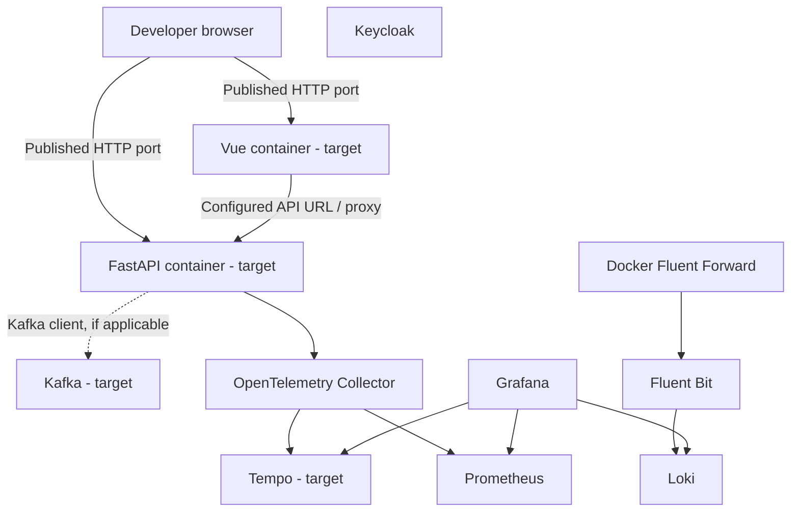

# Deployment View

## Infrastructure Level 1

The local development system is deployed as Docker Compose services on an application network and an observer network. The requested target adds the web applications to `docker-compose.web.yml` and replaces Jaeger with Tempo and RabbitMQ with Kafka.

The diagram shows the target deployment. Existing files already define most infrastructure services, but currently use Jaeger and RabbitMQ; the web Compose file currently defines only the API service. Dashed edges represent a conditional or unspecified application integration.

**Motivation:** Compose provides a repeatable local environment with explicit service names, networks, configuration mounts, and persistent data volumes.

**Quality and performance features:** Local readiness checks exist for some infrastructure services. The system has no declared production SLA, scale target, or resource profile. Local Compose configuration must not be treated as a highly available production deployment.

| Compose/configuration area | Building blocks | Notable mapping |
|---|---|---|
| `deploy/docker-compose.yml` | Loki, Prometheus, tracing backend, Collector, Grafana, Fluent Bit, broker, Keycloak | Infrastructure services; observer network; configuration mounts; Loki, Prometheus, Grafana, and Keycloak data volumes are declared. |
| `deploy/docker-compose.web.yml` | FastAPI API (current definition); Vue frontend (requested) | Current API port mapping is 8080; frontend build/run instructions and published port are not yet defined. |
| `deploy/configs/otel-collector/` | Collector | OTLP receivers; trace exporter currently names Jaeger; metrics endpoint used by Prometheus. |
| `deploy/configs/grafana/provisioning/` | Grafana | Prometheus and Loki datasources plus current Jaeger datasource. |
| `deploy/configs/fluent-bit/` | Fluent Bit | Forward input on 24224 and Loki output to `skb-loki:3100`. |

## Infrastructure Level 2

### Web Application Services

Target: define buildable FastAPI and Vue services in `docker-compose.web.yml`, with host access documented for each and browser-reachable API configuration where needed. The repository currently shows no backend or frontend Dockerfile in the root/project listings, so implementation must provide or select valid build instructions. The supported compose invocation must also resolve any referenced infrastructure services.

### Observability Services

The target trace path is Collector to Tempo to Grafana. Prometheus continues to scrape Collector metrics; Fluent Bit continues to send forwarded logs to Loki. Configuration endpoints, ports, readiness, storage, and network aliases must be consistent across Compose and provisioning files.

### Messaging and Identity Services

Kafka replaces RabbitMQ as the broker service; the local Kafka mode, listener/bootstrap address, persistence, and authentication settings are open implementation decisions. Keycloak is currently deployed independently; no application identity integration contract is specified.

### Deployment Entry Points

The deployment directory contains helper scripts as well as Compose files. At inspection time, `deploy/2_deploy.sh` refers to `docker-compose.cleanwebapi.yml`, which is not present in the directory listing. The implementation should reconcile the documented/startup entry point with the actual Compose file set rather than imply that the script already launches this target architecture.
